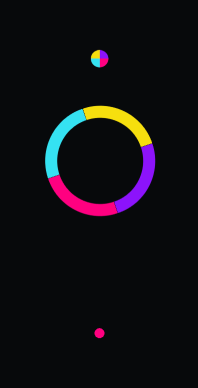

# Simple Color Switch Game in Unity

Welcome to the Simple Color Switch Game repository! This project is a basic implementation of a 2D game inspired by the popular mobile game Color Switch. It was developed using the Unity game engine and serves as an example of simple game development techniques.

## Table of Contents

- [Gameplay](#gameplay)
- [Features](#features)
- [Installation](#installation)
- [Usage](#usage)
- [Contributing](#contributing)

## Gameplay

In this game, players navigate a ball through various obstacles. The ball can only pass through obstacles that match its color. The goal is to collect points and progress through increasingly challenging levels.


### <center>[Click to Play 🎮 ](https://ali181818.github.io/Color-Switch-Unity-Game)</center>

## Features

- Simple and intuitive controls
- Color-based obstacle navigation
- Increasing difficulty with each level
- Basic score tracking

## Installation

To run this game locally, follow these steps:

1. Clone the repository:
    ```bash
    git clone https://github.com/yourusername/simple-color-switch-game.git
    ```
2. Navigate to the project directory:
    ```bash
    cd simple-color-switch-game
    ```
3. Open the project in the Unity game engine.

## Usage

- Launch the game through the Unity game engine.
- Use your mouse or keyboard to control the ball.
- Navigate through the obstacles by matching the ball's color to the obstacles' colors.
- Try to collect as many points as possible!

## Contributing

Contributions are welcome! If you have suggestions for improvements or new features, feel free to create an issue or submit a pull request.

1. Fork the repository.
2. Create a new branch:
    ```bash
    git checkout -b feature/your-feature-name
    ```
3. Commit your changes:
    ```bash
    git commit -m 'Add some feature'
    ```
4. Push to the branch:
    ```bash
    git push origin feature/your-feature-name
    ```
5. Open a pull request.

---

Thank you for checking out the Simple Color Switch Game! If you have any questions or feedback, feel free to reach out.
